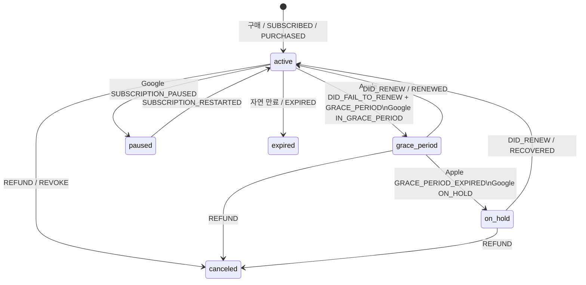

<p align="center">
  <a href="https://www.npmjs.com/package/@onesub/server"></a>
  <a href="https://www.npmjs.com/package/@jeonghwanko/onesub-sdk"></a>
  <a href="https://www.npmjs.com/package/@onesub/mcp-server"></a>
  <br/>
  
  = 20" />
  
</p>

<h1 align="center">onesub</h1>

<p align="center">
  <strong>Server-side receipt validation for react-native-iap. One line.</strong>
</p>

<p align="center">
  react-native-iap handles the purchase.<br/>
  onesub handles everything after — validation, webhooks, subscription state.<br/>
  Open source. Self-hosted. Zero revenue share.
</p>

---

## The Problem

You use `react-native-iap` to handle purchases. But then you need a server to:

- Verify Apple StoreKit 2 receipts (JWS signature validation)
- Verify Google Play receipts (Play Developer API v3)
- Handle webhooks (renewals, cancellations, refunds)
- Track subscription state in a database
- Track one-time purchases (consumables + non-consumables)
- Expose "is this user subscribed?" and "what did this user buy?" endpoints

**That's 2-3 weeks of work.** Or one line:

```ts
app.use(createOneSubMiddleware(config));
```

---

## How It Works

```
react-native-iap (client)            @onesub/server (your backend)
                                      ┌─────────────────────────────────┐
Subscriptions:                        │                                 │
  requestSubscription() ──receipt───▶ │ POST /onesub/validate           │
  fetch('/onesub/status') ──────────▶ │ GET  /onesub/status             │
                                      │                                 │
One-time purchases:                   │                                 │
  requestPurchase() ────receipt───▶   │ POST /onesub/purchase/validate  │
  fetch('/onesub/purchase/status') ──▶│ GET  /onesub/purchase/status    │
                                      │                                 │
Webhooks (auto):                      │ POST /onesub/webhook/apple      │
                                      │ POST /onesub/webhook/google     │
                                      └─────────────────────────────────┘
```

---

## Quick Start

### 1. Install

```bash
npm install @onesub/server
```

### 2. Add to your Express app

```ts
import { createOneSubMiddleware, PostgresSubscriptionStore, PostgresPurchaseStore } from '@onesub/server';

app.use(createOneSubMiddleware({
  apple: {
    bundleId: 'com.yourapp.id',
    sharedSecret: process.env.APPLE_SHARED_SECRET,
  },
  google: {
    packageName: 'com.yourapp.id',
    serviceAccountKey: process.env.GOOGLE_SERVICE_ACCOUNT_KEY,
  },
  database: { url: process.env.DATABASE_URL },
  store: new PostgresSubscriptionStore(process.env.DATABASE_URL),
  purchaseStore: new PostgresPurchaseStore(process.env.DATABASE_URL),
}));
```

### 3. Check subscription from your app

```ts
const res = await fetch('https://api.yourapp.com/onesub/status?userId=user123');
const { active } = await res.json();
// active: true → subscribed, false → not subscribed
```

**Done.** Apple/Google receipt validation, webhooks, and subscription tracking — all handled.

---

## What You Get

### Subscriptions (auto-renewable)

| Endpoint | What it does |
|----------|-------------|
| `POST /onesub/validate` | Verify receipt, save subscription |
| `GET /onesub/status?userId=` | Check if user has active subscription |
| `POST /onesub/webhook/apple` | Handle App Store Server Notifications V2 |
| `POST /onesub/webhook/google` | Handle Google Real-Time Developer Notifications |

#### Lifecycle states

`SubscriptionInfo.status` carries the full lifecycle. The `/onesub/status` route's `active: boolean` collapses it for simple gating; the raw status lets you render accurate UX.



| State | `active` | When | Host UX hint |
|-------|---------|------|-------------|
| `active` | ✅ | paid period | normal |
| `grace_period` | ✅ | payment failed but store still grants access | "결제 정보 확인 필요 (계속 사용 가능)" |
| `on_hold` | ❌ | grace ended, billing retry continues | "결제 정보를 업데이트하세요" |
| `paused` | ❌ | user-voluntary pause (Google only) | "재개 예정: \{autoResumeTime\}" |
| `expired` | ❌ | natural end without renewal | re-purchase |
| `canceled` | ❌ | refunded or revoked | re-purchase / restore |

`active` is computed as `(active || grace_period) && expiresAt > now` — the `expiresAt` check is a backstop for missed `EXPIRED` webhooks and for the `'until_expiry'` refund policy.

### One-time Purchases (consumable + non-consumable)

| Endpoint | What it does |
|----------|-------------|
| `POST /onesub/purchase/validate` | Verify receipt, save purchase. Response includes `action: 'new' \| 'restored'` so the client can distinguish a first-time purchase from an idempotent replay or reinstall-triggered reassignment. |
| `GET /onesub/purchase/status?userId=` | List user's purchases |

### Admin (opt-in — requires `config.adminSecret`)

Mounted only when `config.adminSecret` is set. All requests must include the `X-Admin-Secret` header.

**Purchase admin** (testing + migration):

| Endpoint | What it does |
|----------|-------------|
| `DELETE /onesub/purchase/admin/:userId/:productId` | Wipe a non-consumable so the user can re-test the purchase flow |
| `POST /onesub/purchase/admin/grant` | Manually insert a purchase record (bypasses store verification) |
| `POST /onesub/purchase/admin/transfer` | Reassign a `transactionId` to a new `userId` (legitimate device/account migration) |

**Dashboard / operational**:

| Endpoint | What it does |
|----------|-------------|
| `GET /onesub/admin/subscriptions?userId=&status=&productId=&platform=&limit=&offset=` | Filtered + paginated subscription list (max 200 per page) |
| `GET /onesub/admin/subscriptions/:transactionId` | Single subscription record by `originalTransactionId` |
| `GET /onesub/admin/customers/:userId` | Full per-user profile: subscriptions + purchases + entitlements (when configured) |
| `GET /onesub/admin/webhook-deadletters` | List failed webhook jobs (requires BullMQ queue) |
| `POST /onesub/admin/webhook-replay/:id` | Replay a failed webhook job (requires BullMQ queue) |

### Entitlements (opt-in — requires `config.entitlements`)

Map abstract feature flags to one or more product IDs. A user is entitled when they have an **active subscription** or a **non-consumable purchase** for any product in the list. Consumables are excluded — they grant a one-time resource, not an ongoing right.

```ts
app.use(createOneSubMiddleware({
  ...config,
  entitlements: {
    premium: { productIds: ['pro_monthly', 'pro_yearly', 'premium_unlock'] },
    adFree:  { productIds: ['remove_ads'] },
  },
}));
```

| Endpoint | What it does |
|----------|-------------|
| `GET /onesub/entitlement?userId=&id=premium` | Single check: `{ id, active, source, productId?, expiresAt? }` |
| `GET /onesub/entitlements?userId=` | All entitlements in one round-trip — use on app launch / login |

SDK: `const { entitlements, hasEntitlement } = useOneSub();` — fetches the full map from the server and re-evaluates on subscription change.

### Metrics (opt-in — same `config.adminSecret`, same `X-Admin-Secret` header)

Read-only aggregate counts. Revenue metrics (MRR, ARR) require per-product price configuration and are not yet implemented.

| Endpoint | What it does |
|----------|-------------|
| `GET /onesub/metrics/active` | Current active count: `{ total, activeSubscriptions, gracePeriodSubscriptions, nonConsumablePurchases, byProduct, byPlatform }` |
| `GET /onesub/metrics/started?from=&to=&groupBy=` | Subscriptions started in a date range |
| `GET /onesub/metrics/expired?from=&to=&groupBy=` | Subscriptions expired or canceled in a date range |
| `GET /onesub/metrics/purchases/started?from=&to=&groupBy=` | Non-consumable purchases started in a date range |

`from` and `to` are ISO 8601 timestamps. Add `groupBy=day` to get a UTC-bucketed time series in the `buckets` field.

**Consumables** (coins, credits): Can be purchased multiple times. Each purchase is tracked.

**Non-consumables** (unlock premium, remove ads): Purchased once. Duplicate purchases are rejected with `409 NON_CONSUMABLE_ALREADY_OWNED`.

```ts
// Validate a consumable purchase
const res = await fetch('https://api.yourapp.com/onesub/purchase/validate', {
  method: 'POST',
  headers: { 'Content-Type': 'application/json' },
  body: JSON.stringify({
    platform: 'apple',
    receipt: transactionReceipt,
    userId: 'user123',
    productId: 'credits_100',
    type: 'consumable',    // or 'non_consumable'
  }),
});
const { valid, purchase } = await res.json();
```

## What's Under the Hood

- **Apple**: StoreKit 2 JWS verified against Apple Root CA G3 (full x5c chain), App Store Server API for status fetch fallback + CONSUMPTION_REQUEST response, JWT minting cached + Promise-deduped
- **Google**: OAuth2 service account → Play Developer API **v3** (`subscriptionsv2.get`) — `subscriptionState` enum directly mapped to lifecycle states (no expiry/cancelReason inference)
- **Webhooks**: Lifecycle classification for grace_period / on_hold / paused (Apple subtype + Google notification types), `acknowledgePurchase` auto-called for Google subs+IAP, `voidedPurchasesNotification` routed to right store, `linkedPurchaseToken` chain tracking for plan changes
- **Refund policy**: Choose `'immediate'` (default — flip status=canceled) or `'until_expiry'` (keep entitlement until original expiry)
- **Outbound calls**: All upstream fetches (Apple/Google APIs) wrapped with `AbortController` timeout (default 10s) so a hung upstream doesn't pile up webhook handlers
- **Storage**: Pluggable `SubscriptionStore` + `PurchaseStore` — built-in PostgreSQL (auto-backfilled columns via `ALTER TABLE IF NOT EXISTS`) + in-memory
- **Validation**: zod input validation, 50KB body limit, userId length checks
- **Tests**: 296+ tests (single-notification units + multi-notification e2e lifecycle scenarios)
- **Security**: [Full details →](docs/SECURITY.md)
- **Troubleshooting**: [errorCode → cause → fix](docs/RECEIPT-ERRORS.md)
- **Migration**: [Per-version upgrade notes](docs/MIGRATION.md)

---

## Optional: React Native SDK

If you want a drop-in React hook + paywall component (built on react-native-iap):

```bash
npm install @jeonghwanko/onesub-sdk react-native-iap
```

```tsx
import { OneSubProvider, useOneSub } from '@jeonghwanko/onesub-sdk';

// Wrap your app
<OneSubProvider config={{ serverUrl, productId }} userId={userId}>
  <App />
</OneSubProvider>

// Subscriptions
const { isActive, subscribe, restore } = useOneSub();

// One-time products (consumable / non-consumable)
const { purchaseProduct, restoreProduct } = useOneSub();

// Purchase a consumable (e.g. coins)
const purchase = await purchaseProduct('credits_100', 'consumable');
// purchase is null if user cancelled, PurchaseInfo (+ action) on success

// Purchase a non-consumable (e.g. premium unlock)
const purchase = await purchaseProduct('premium_unlock', 'non_consumable');
if (purchase?.action === 'restored') {
  // already owned — show "복원 완료" instead of "구매 완료"
}

// Restore a non-consumable from the store's purchase history
const restored = await restoreProduct('premium_unlock', 'non_consumable');
```

**Mock mode** — set `config.mockMode: true` to return synthetic success from `subscribe` / `restore` / `purchaseProduct` / `restoreProduct` without calling `react-native-iap` or the onesub server. Useful for running UI flows in Expo Go / the simulator. Never enable in production.

**Peer dependency:** SDK requires `react-native-iap` **v15+** (event-based purchase flow).

The SDK is optional. You can use `@onesub/server` with any client — React Native, Flutter, or plain HTTP calls.

---

## Optional: MCP Server (AI Integration)

For Claude Code / Cursor users — AI helps set up your subscription:

```json
{ "mcpServers": { "onesub": { "command": "npx", "args": ["@onesub/mcp-server"] } } }
```

> "Add a monthly subscription to my Expo app"

### Skill document for AI agents

A single-file integration guide optimized for LLM ingestion lives at [`SKILL.md`](SKILL.md). Point Claude / Cursor / any agent at it for complete onesub context:

> Read `https://raw.githubusercontent.com/jeonghwanko/onesub/master/SKILL.md` then integrate onesub into this project.

---

## Packages

| Package | Version | What | Install |
|---------|---------|------|---------|
| [`@onesub/server`](https://www.npmjs.com/package/@onesub/server) |  | Express middleware — receipt validation + webhooks | `npm i @onesub/server` |
| [`@jeonghwanko/onesub-sdk`](https://www.npmjs.com/package/@jeonghwanko/onesub-sdk) |  | React Native SDK — `useOneSub()` + `<Paywall />` | `npm i @jeonghwanko/onesub-sdk` |
| [`@onesub/mcp-server`](https://www.npmjs.com/package/@onesub/mcp-server) |  | MCP tools — AI creates products + paywalls | `npx @onesub/mcp-server` |
| [`@onesub/providers`](https://www.npmjs.com/package/@onesub/providers) |  | App Store Connect + Google Play API wrappers (standalone) | `npm i @onesub/providers` |
| [`@onesub/cli`](https://www.npmjs.com/package/@onesub/cli) |  | Scaffolds a starter server project | `npx @onesub/cli init` |
| [`@onesub/shared`](https://www.npmjs.com/package/@onesub/shared) |  | Shared TypeScript types | Auto-installed |

---

## vs RevenueCat

| | RevenueCat | onesub |
|---|---|---|
| Receipt validation | Their servers | **Your server** |
| Revenue share | 1% after $2.5K | **0% forever** |
| Data ownership | Their database | **Your database** |
| Vendor lock-in | Yes | **No (MIT open source)** |
| Dashboard | Yes | Not yet |
| Setup time | 2-3 hours | **10 minutes** |

**onesub is not a RevenueCat replacement.** RevenueCat offers analytics, experiments, and a dashboard. onesub is for developers who want to own their subscription infrastructure.

Already on RevenueCat and curious? See [`docs/MIGRATE-FROM-REVENUECAT.md`](docs/MIGRATE-FROM-REVENUECAT.md) — a step-by-step guide covering client code, historical data, webhook switchover, and rollback.

---

## Examples

Working examples to get you started in minutes:

| Example | What | Run |
|---------|------|-----|
| [`examples/server`](examples/server) | Express server with receipt validation | `npm start` |
| [`examples/expo-app`](examples/expo-app) | Expo Router app with paywall | `npx expo start` |

```bash
# 1. Start the server
cd examples/server
cp .env.example .env   # add your Apple/Google credentials
npm install && npm start

# ── or, full stack (server + Postgres) in one command ──
docker compose up      # http://localhost:4100

# 2. Start the app (in another terminal)
cd examples/expo-app
npm install && npx expo start
```

---

## Custom Store

Built-in PostgreSQL store, or bring your own:

```ts
import { SubscriptionStore } from '@onesub/server';

class RedisStore implements SubscriptionStore {
  async save(sub) { /* ... */ }
  async getByUserId(userId) { /* ... */ }
  async getByTransactionId(txId) { /* ... */ }
}

app.use(createOneSubMiddleware({ ...config, store: new RedisStore() }));
```

The canonical Postgres schema is shipped with the package at
[`packages/server/sql/schema.sql`](packages/server/sql/schema.sql). Apply it
with `psql -f` if you manage migrations externally, or let `store.initSchema()`
run it for you on startup.

---

## Roadmap

- [x] Apple StoreKit 2 receipt validation (JWKS verified, x5c chain → Apple Root CA G3)
- [x] Google Play Billing v3 (`subscriptionsv2.get` resource)
- [x] Webhook handlers (Apple V2 + Google RTDN, voided purchases included)
- [x] Lifecycle states: `grace_period` / `on_hold` / `paused` (correct classification, not inferred)
- [x] PostgreSQL subscription store + purchase store (auto-backfill via `ALTER TABLE IF NOT EXISTS`)
- [x] React Native SDK + paywall components
- [x] MCP server for AI-assisted setup
- [x] Apple App Store Server API direct fetch — webhook miss recovery + Status sync
- [x] Apple `CONSUMPTION_REQUEST` response hook (server-signed JWT to Apple)
- [x] Google `acknowledgePurchase` auto-call (subs + non-consumable IAP) — no more 3-day auto-refunds
- [x] Google `linkedPurchaseToken` continuity (plan upgrade userId inheritance)
- [x] Refund policy (`immediate` | `until_expiry`)
- [x] Outbound fetch hardening (Apple JWT cache + Promise dedup, `AbortController` timeout)
- [x] Security hardening (zod validation, body limits, signature verification)
- [x] e2e lifecycle scenario test suite (multi-notification sequences)
- [x] CLI scaffolding (`npx @onesub/cli init`)
- [ ] Apple Family Sharing (`FAMILY_SHARED`)
- [ ] Apple Promotional Offer server-side signing
- [ ] Google `oneTimeProductNotification` (currently only voided purchases handled for IAP)
- [ ] Apple Transaction History API (replay past transactions)
- [ ] Analytics dashboard
- [ ] Hosted service (no server needed)

---

## Contributing

```bash
git clone https://github.com/jeonghwanko/onesub.git
cd onesub && npm install && npm run build && npm test
```

See [CLAUDE.md](CLAUDE.md) for architecture and conventions.

---

## License

[MIT](LICENSE)

---

<p align="center">
  <strong>react-native-iap</strong> handles the purchase.<br/>
  <strong>onesub</strong> handles everything after.
</p>
